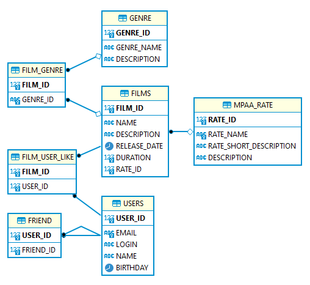

# java-filmorate
## Схема БД:



#### friend
* Запросы в друзья реализованы через таблицу friend c **составным уникальным индексом** из полей: user_id, friend_id.

#### film_user_like
* Содержит 2 поля и оба входят в составной PrimaryKey что не дает возможности пользователю поставить одному и тому же фильму несколько "классов"

### Основные запросы к БД
```sql
-- получить список всех фильмов
SELECT f.FILM_ID, f.NAME, f.DESCRIPTION ,f.RELEASE_DATE ,f.DURATION ,f.RATE_ID ,mr.RATE_NAME FROM FILMS f 
LEFT JOIN MPAA_RATE mr ON f.RATE_ID  = mr.RATE_ID;

-- найти фильм по id
SELECT f.FILM_ID 
      , f.NAME 
      , f.DESCRIPTION  
      , f.RELEASE_DATE 
      , f.DURATION 
      , f.RATE_ID  
      , mr.RATE_NAME  
      FROM FILMS f
      LEFT JOIN MPAA_RATE mr ON f.RATE_ID  = mr.RATE_ID  
      WHERE FILM_ID = ?;

-- Поставить лайк фильму(filmId) от пользователя (userId)
INSERT INTO FILM_USER_LIKE (FILM_ID, USER_ID) VALUES (?, ?)

-- Удалить лайк фильму(filmId) от пользователя (userId)
DELETE FROM FILM_USER_LIKE WHERE FILM_ID = ? AND USER_ID = ?

-- Получить всех пользователей
SELECT u.USER_ID, u.EMAIL, u.LOGIN , u.NAME , u.BIRTHDAY FROM USERS u;

-- Получить пользователя по userId
SELECT u.USER_ID, u.EMAIL, u.LOGIN , u.NAME , u.BIRTHDAY FROM USERS u WHERE USER_ID = ?;

-- Общие друзья
SELECT u.USER_ID, u.EMAIL, u.LOGIN , u.NAME , u.BIRTHDAY FROM FRIEND f
JOIN USERS u ON f.FRIEND_ID = u.USER_ID
WHERE f.USER_ID  = ?
AND EXISTS (SELECT 1 FROM FRIEND f2 WHERE FRIEND_ID = f.FRIEND_ID AND  USER_ID = ?)

```
